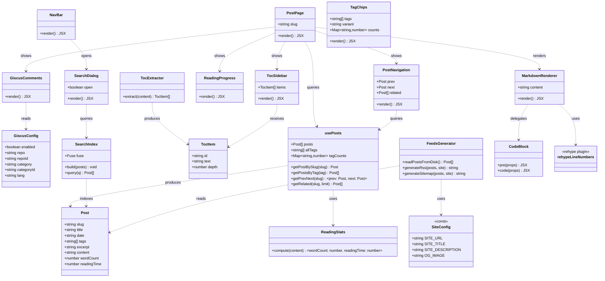
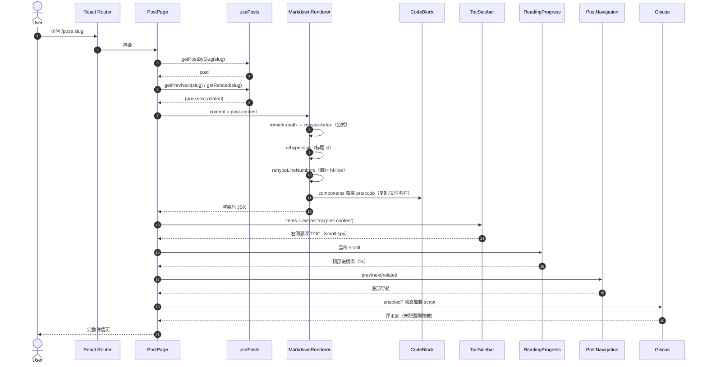
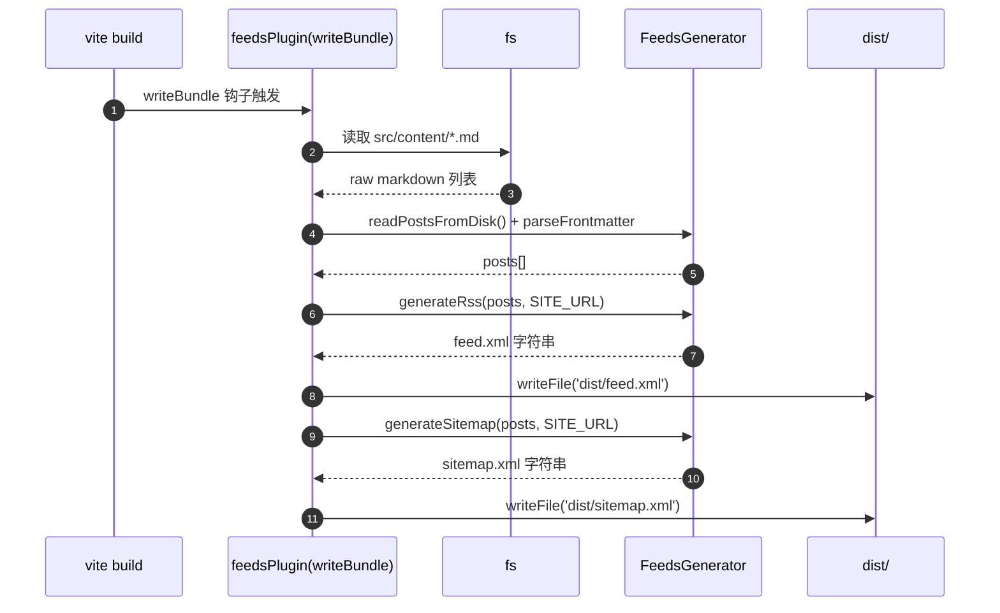
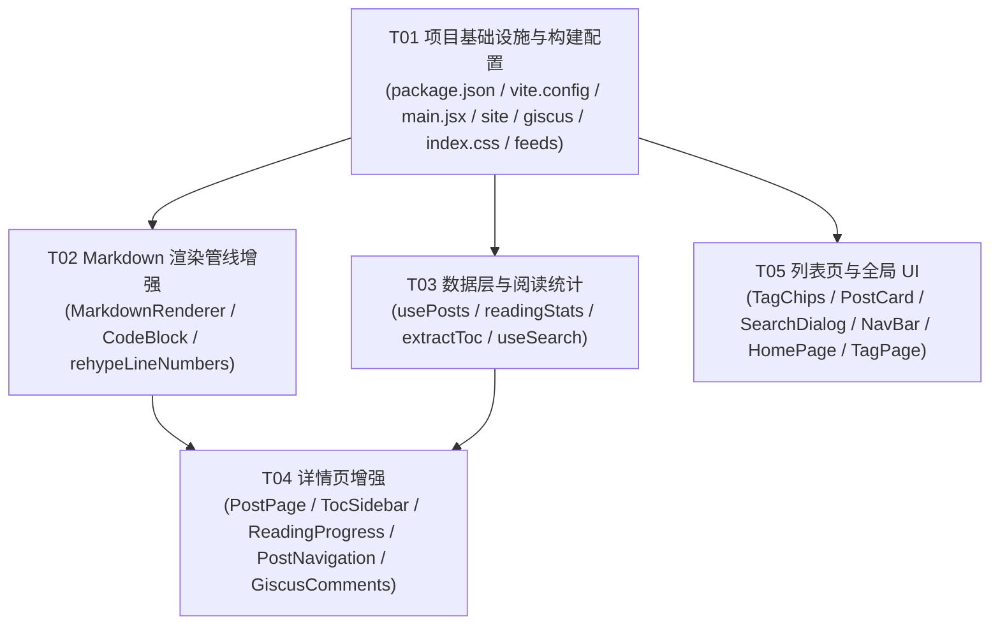

# 个人博客功能增强 — 系统架构设计 + 任务分解

> 作者：架构师 `高见远`（software-architect）
> 适用范围：已有静态 Markdown 博客（Vite 5 + React 18 + MUI 5 + Tailwind 3 + react-markdown 9 + rehype-highlight + remark-gfm）
> 目标：一次性实现三梯队共 10 项功能增强（P0 × 3 / P1 × 4 / P2 × 3）

---

## 0. 现状确认（基于仓库实读，设计以此为准）

| 项 | 确认结果 | 对设计的影响 |
|---|---|---|
| Markdown 管线 | `src/components/MarkdownRenderer.jsx` 仅用 `react-markdown` + `remark-gfm` + `rehype-highlight`，**无 `components` 覆盖** | P0 公式/TOC/代码块增强都通过扩展此文件与新增 rehype 插件实现 |
| 数据层 | `src/hooks/usePosts.js` 用 `import.meta.glob('../content/*.md',{query:'?raw',import:'default',eager:true})`，产出 `posts/allTags/getPostBySlug/getPostsByTag`；post 含 `slug,title,date,tags,excerpt,content` | 阅读时间/字数、上/下篇、相关文章、标签计数、TOC 提取、搜索索引均在此扩展或配合新增 util |
| 主题机制 | `ThemeModeProvider.jsx` 中 `STORAGE_KEY='blog-theme-mode'`，并在 `useEffect` 中 `document.body.setAttribute('data-theme', mode)` | **严禁破坏**；组件背景/文字一律用 MUI `palette`，不写死色值 |
| 极光背景 | `src/index.css` 中 `body{background-image:...}` 与 `body[data-theme='dark']{...}` | **严禁破坏**；新增样式（行号/代码栏/TOC/进度条/标签云/KaTeX 调校）只追加，不改动这两段 |
| 测试约束 | `HomePage.test.jsx` 断言保留「按标签浏览：」文案；首张 `h2` 必须为最新文章标题（来自 `PostCard` 的 `component="h2"`） | `TagChips` 升级为标签云**不得引入新的 h2**；HomePage 文案/结构保持不变 |
| 构建配置 | `vite.config.js`：`base:'/'`、`plugins:[react()]`、`test.env=jsdom`、`css:false` | RSS/sitemap 通过**内联 Vite 插件**（`writeBundle` 钩子）写 `dist`，无需新增 npm 包 |
| 部署 | `.github/workflows/deploy.yml` 已存在（build → 复制 `dist/index.html` 为 `404.html` → Pages） | feed.xml/sitemap.xml 落在 `dist/` 即可随产物部署；无需新增 workflow |
| 路由/入口 | `main.jsx` 用 `BrowserRouter basename={BASE_URL}`；`App.jsx` 路由含 `/`、`/post/:slug`、`/tag`、`/tag/:tag`、`/about` | OG meta 在 `main.jsx` 包 `HelmetProvider`，在页面注入 `Helmet` |

**必须保留的契约**：主题切换机制、极光背景、37 项现有 vitest 测试、文章列表/Markdown 详情/标签筛选/路由行为。

---

## 1. 实现方案 + 框架选型

| # | 功能 | 梯队 | 技术选型 | 理由 |
|---|---|---|---|---|
| 1 | LaTeX 公式 `$...$` / `$$...$$` | P0 | `remark-math` + `rehype-katex` + `katex`，引入 `katex/dist/katex.min.css` | 与 react-markdown 9 的 remark/rehype 管线天然契合；KaTeX 零运行时依赖、渲染快；`rehype-katex` 直接消费 `remark-math` 产物 |
| 2 | 文章目录 TOC + 阅读进度条 | P0 | `rehype-slug`（标题自动加 id）+ `github-slugger`（TOC 文本生成同算法 id）+ `TocSidebar` 组件（scroll-spy）+ `ReadingProgress` 组件（滚动监听） | `rehype-slug` 内部即使用 `github-slugger`，两端算法一致保证锚点命中；窄屏 `<960px` 用 CSS `display`/`useMediaQuery` 隐藏或折叠 |
| 3 | 上一篇/下一篇 + 相关文章 | P1 | `usePosts` 扩展 `getPrevNext(slug)`、`getRelated(slug,limit=3)`；`PostNavigation` 组件 | 文章已按日期倒序，`prev/next` 即相邻索引；相关文章按标签重合度降序，无重合优雅降级（隐藏区块） |
| 4 | 站内模糊搜索 | P1 | `fuse.js`（运行期索引 `title/excerpt/tags`）+ `SearchDialog` 组件（`NavBar` 右侧入口） | 纯前端、无后端；`Fuse` 支持中文模糊匹配；索引在 `useMemo` 内构建一次 |
| 5 | 代码块增强（复制/行号/文件名栏） | P1 | `MarkdownRenderer` 通过 `components` 覆盖 `pre/code` 委托给 `CodeBlock`；行号用**自定义 rehype 插件** `rehypeLineNumbers` 包裹每行 `<span class="hl-line">` + CSS `counter`；复制用 `navigator.clipboard`（降级 `execCommand`） | 保留 `rehype-highlight` 着色；自定义 rehype 插件在 highlight 之后执行，使纯 CSS 计数器可行；文件名从围栏 info string（如 ` ```js:app.js `）解析 |
| 6 | 阅读时间 / 字数统计 | P1 | `src/utils/readingStats.js`：`CJK 字数/400 + 拉丁词数/200`（向上取整）；在 `toPost` 时挂到 post（`wordCount/readingTime`） | 中英文混排按不同速率；预计算避免渲染期重复解析；现有测试只断言既有字段，新增字段不破坏 |
| 7 | 标签云视觉化 | P1 | `TagChips` 增加 `variant='cloud'`，字号随 `tagCounts`（来自 `usePosts`）缩放；保留 `clickable`→`/tag/:tag` | 复用现有组件与跳转；HomePage/TagPage 传 `counts` 触发云模式，文章卡片内仍用均匀尺寸 |
| 8 | RSS feed `/feed.xml` | P2 | 构建期内联 Vite 插件（`writeBundle`）读 `src/content/*.md` → `parseFrontmatter` → `FeedsGenerator.generateRss()` → 写 `dist/feed.xml` | 无后端、构建期生成最稳；复用现有 `parseFrontmatter`（纯函数）；无需新增 npm 包 |
| 9 | sitemap.xml + OG 社交卡片 | P2 | sitemap：同 (8) 内联插件 `generateSitemap()` 写 `dist/sitemap.xml`；OG：`react-helmet-async` 在 `PostPage` 注入 `og:*/twitter:*` | sitemap 与 RSS 同源生成；`react-helmet-async` 客户端注入，随路由变化；默认分享图 `public/og-default.png` |
| 10 | Giscus 评论 | P2 | `GiscusComments` 组件：读 `src/config/giscus.js`，`enabled` 时动态 `appendChild` giscus script；**未配置则隐藏/占位，不报错** | 零后端；配置（repo/repo-id/category/category-id）由用户后续提供，占位约定保证可编译可运行 |

**架构风格**：在既有「数据层 (`usePosts`) + 渲染层 (`MarkdownRenderer`) + 页面层 (`*Page`) + 全局 (`Layout/NavBar`)」上做**增量增强**，不引入新状态管理/路由框架；构建期产物（RSS/sitemap）走 Vite 插件，运行期增强走组件与 hook。

---

## 2. 文件列表及相对路径

> 图例：🆕 新增　✏️ 改动

| 相对路径 | 类型 | 说明 |
|---|---|---|
| `package.json` | ✏️ | 新增依赖：katex / remark-math / rehype-katex / rehype-slug / github-slugger / fuse.js / react-helmet-async |
| `vite.config.js` | ✏️ | 注册内联 feeds 插件（RSS + sitemap），构建期写 `dist` |
| `src/main.jsx` | ✏️ | 外层包 `<HelmetProvider>` |
| `src/config/site.js` | 🆕 | 集中常量：`SITE_URL` / `SITE_TITLE` / `SITE_DESCRIPTION` / `OG_IMAGE`（RSS/sitemap/OG 共用） |
| `src/config/giscus.js` | 🆕 | Giscus 配置占位 + `enabled` 开关（默认 false） |
| `src/index.css` | ✏️ | **仅追加**：行号计数器、代码标题栏、TOC、进度条、标签云、KaTeX 微调样式；不改动极光背景两段 |
| `src/utils/feeds.js` | 🆕 | `readPostsFromDisk()` + `generateRss()` + `generateSitemap()`（纯函数，供 Vite 插件调用） |
| `src/components/MarkdownRenderer.jsx` | ✏️ | 接入 remark-math/rehype-katex/rehype-slug + `rehypeLineNumbers` + `components` 覆盖委托 `CodeBlock`；引入 `katex.min.css` |
| `src/components/CodeBlock.jsx` | 🆕 | `pre`/`code` 覆盖实现：文件名标题栏 + 一键复制 + 行号容器 |
| `src/utils/rehypeLineNumbers.js` | 🆕 | 自定义 rehype 插件：将 `pre>code` 每行包裹为 `<span class="hl-line">` 以支持 CSS 计数器 |
| `src/hooks/usePosts.js` | ✏️ | 扩展 `toPost` 增加 `wordCount/readingTime`；新增 `tagCounts`、`getPrevNext(slug)`、`getRelated(slug,limit)` |
| `src/utils/readingStats.js` | 🆕 | 字数 / 阅读分钟计算（中英文区分速率） |
| `src/utils/extractToc.js` | 🆕 | 解析 Markdown 的 h2/h3，用 `github-slugger` 生成与 `rehype-slug` 一致的 id |
| `src/hooks/useSearch.js` | 🆕 | 基于 `fuse.js` 构建索引并提供 `query(q)` |
| `src/pages/PostPage.jsx` | ✏️ | 集成 TOC 悬浮、进度条、阅读时间、上/下篇+相关、`GiscusComments`、`<Helmet>` OG meta |
| `src/components/TocSidebar.jsx` | 🆕 | 右侧悬浮 TOC（scroll-spy 高亮当前节；`<960px` 隐藏/折叠） |
| `src/components/ReadingProgress.jsx` | 🆕 | 顶部细进度条（滚动百分比） |
| `src/components/PostNavigation.jsx` | 🆕 | 底部「上一篇/下一篇」+「相关文章」（无相关则降级隐藏） |
| `src/components/GiscusComments.jsx` | 🆕 | 动态加载 Giscus script；未配置优雅降级 |
| `src/components/TagChips.jsx` | ✏️ | 增加 `variant='cloud'` + `counts` 支持字号随文章数缩放；保留点击跳转 |
| `src/components/PostCard.jsx` | ✏️ | 显示阅读时间（取自 `post.readingTime`） |
| `src/components/SearchDialog.jsx` | 🆕 | 搜索入口 + 结果对话框（用 `useSearch`） |
| `src/components/NavBar.jsx` | ✏️ | 右侧新增搜索入口按钮，打开 `SearchDialog` |
| `src/pages/HomePage.jsx` | ✏️ | 保持「按标签浏览：」文案与首 h2=最新文章；`TagChips` 传 `variant='cloud'` + `counts` |
| `src/pages/TagPage.jsx` | ✏️ | 总览模式 `TagChips` 传 `variant='cloud'` + `counts` |

---

## 3. 数据结构和接口（类图）



**关键接口签名（设计层，非实现）**

```js
// src/utils/readingStats.js
readingStats.compute(content: string): { wordCount: number; readingTime: number }
// 规则：cjk = 匹配 /[\u4e00-\u9fff\u3040-\u30ff]/g 的字符数；latin = 非空白非CJK词数
//      readingTime = Math.max(1, Math.ceil(cjk/400 + latin/200))

// src/utils/extractToc.js
extractToc(content: string): TocItem[]   // 仅 h2/h3；id 用 github-slugger 顺序生成（与 rehype-slug 一致）

// src/hooks/usePosts.js 扩展
getPrevNext(slug): { prev: Post|undefined, next: Post|undefined }
getRelated(slug, limit=3): Post[]          // 标签集合重合度降序，排除自身；空则返回 []
tagCounts: Map<string, number>             // 标签 -> 文章数

// src/hooks/useSearch.js
useSearch(): { query: (q: string) => Post[] }   // 内部 Fuse(posts, {keys:['title','excerpt','tags'], threshold:0.4, ignoreLocation:true})

// src/utils/feeds.js
readPostsFromDisk(): Post[]                       // fs 读 src/content/*.md + parseFrontmatter
generateRss(posts: Post[], site: SiteConfig): string
generateSitemap(posts: Post[], site: SiteConfig): string

// src/config/site.js
export const SITE_URL = import.meta.env.VITE_SITE_URL || 'https://example.com'
export const SITE_TITLE = '颜培志 · 博客'
export const SITE_DESCRIPTION = '脉冲涡流无损检测 / 学术 / 生活随笔'
export const OG_IMAGE = '/og-default.png'

// src/config/giscus.js
export const giscus = { enabled: false, repo:'', repoId:'', category:'', categoryId:'', lang:'zh-CN' }
```

---

## 4. 程序调用流程（时序图）

### 4.1 详情页加载（运行期）



### 4.2 构建期 RSS / sitemap 生成



---

## 5. Anything UNCLEAR（待明确 / 假设）

- **SITE_URL 实际值**：当前 `vite.config.js` 的 `base:'/'`，对应 GitHub Pages 用户/组织站；若为项目页则需 `base:'/repo/'` 且 `SITE_URL` 改为 `https://<user>.github.io/<repo>/`。设计以「常量集中 + 可用 `VITE_SITE_URL` 覆盖」应对，具体值待定。
- **OG 默认分享图来源**：设计约定放 `public/og-default.png`（1200×630），但图资源需用户提供/生成。
- **Giscus 配置到位时间**：`repo/repoId/category/categoryId` 由用户开启 Discussions + 安装 Giscus App 后提供；在到位前 `enabled=false`，评论区隐藏且不报错。
- **行号 CSS 计数器的实现细节**：纯 CSS 计数器要求每行是独立元素；`rehypeLineNumbers` 需在 `rehype-highlight` **之后**对已是高亮 span 的文本按换行拆分并保留着色。若拆分复杂，退化为在 `CodeBlock` 的 `code` 覆盖中按 `\n` 计算行数并以 JS 渲染行号列（功能等价）。
- **SPA 的 OG 限制**：`react-helmet-async` 为客户端注入，搜索引擎爬虫（非 JS）可能取不到动态 OG；如需真静态 OG 需 SSR/预渲染（超出本次范围），已在待明确项标注。
- **是否新增 deploy.yml**：现有 workflow 已可部署 `dist/`，feed.xml/sitemap.xml 随产物上线；仅需确认是否在 `index.html`/robots 中引用 sitemap（可选）。
- **测试补充**：37 项现有测试必须保留通过；新增组件（TOC/搜索/进度条等）的测试为可选，不强制。

---

## 6. 依赖包列表（新增 npm 包）

```
- katex@^0.16.11            : LaTeX 公式渲染样式与运行库（引入 katex/dist/katex.min.css）
- remark-math@^6.0.0        : 解析 $...$ / $$...$$ 数学标记
- rehype-katex@^7.0.0       : 将 remark-math 产物渲染为 KaTeX
- rehype-slug@^6.0.0        : 为标题自动生成 id（内部用 github-slugger）
- github-slugger@^2.0.0     : TOC 提取时生成与 rehype-slug 一致的锚点 id
- fuse.js@^7.0.0            : 前端模糊搜索索引
- react-helmet-async@^2.0.5 : 客户端注入 OG/Twitter meta
```
> 说明：RSS/sitemap 的内联 Vite 插件**不引入新 npm 包**（复用 Node `fs` + 现有 `parseFrontmatter`）。`react-helmet-async` 需与 React 18 兼容（v2 满足）。

---

## 7. 任务列表（有序、含依赖、按实现顺序）

> 硬约束：≤5 个任务；每任务 ≥3 个文件；按模块/层次分组；**T01 必为项目基础设施**；尽量减少线性依赖链。

| Task ID | Task Name | Source Files（来自 §2） | Dependencies | Priority |
|---|---|---|---|---|
| **T01** | 项目基础设施与构建配置 | `package.json`、`vite.config.js`、`src/main.jsx`、`src/config/site.js`🆕、`src/config/giscus.js`🆕、`src/index.css`、`src/utils/feeds.js`🆕 | — | P0 |
| **T02** | Markdown 渲染管线增强（公式 + slug + 代码块增强） | `src/components/MarkdownRenderer.jsx`、`src/components/CodeBlock.jsx`🆕、`src/utils/rehypeLineNumbers.js`🆕 | T01 | P0 |
| **T03** | 数据层与阅读统计（usePosts 扩展 + TOC/搜索 util） | `src/hooks/usePosts.js`、`src/utils/readingStats.js`🆕、`src/utils/extractToc.js`🆕、`src/hooks/useSearch.js`🆕 | T01 | P0/P1 |
| **T04** | 详情页增强（TOC + 进度条 + 阅读时间 + 上/下篇 + 相关 + Giscus + OG） | `src/pages/PostPage.jsx`、`src/components/TocSidebar.jsx`🆕、`src/components/ReadingProgress.jsx`🆕、`src/components/PostNavigation.jsx`🆕、`src/components/GiscusComments.jsx`🆕 | T02, T03, T01 | P0/P1/P2 |
| **T05** | 列表页与全局 UI（标签云 + 搜索入口 + 阅读时间展示） | `src/components/TagChips.jsx`、`src/components/PostCard.jsx`、`src/components/SearchDialog.jsx`🆕、`src/components/NavBar.jsx`、`src/pages/HomePage.jsx`、`src/pages/TagPage.jsx` | T03, T01 | P1/P2 |

**功能 → 任务映射**
- P0-①LaTeX → T02；P0-②TOC+进度条 → T04（slug 来自 T02）；P1-⑤代码块 → T02
- P1-③上/下篇+相关 → T04（数据来自 T03）；P1-④搜索 → T05（索引来自 T03）；P1-⑥阅读时间 → T03(数据)+T04/T05(展示)；P1-⑦标签云 → T05（counts 来自 T03）
- P2-⑧RSS → T01；P2-⑨sitemap → T01、OG → T04；P2-⑩Giscus → T04

**建议实现顺序**：T01 →（T02 ∥ T03）→ T04 → T05。

---

## 8. 共享知识（跨文件约定）

- **锚点 slug 算法统一**：TOC 提取（`extractToc`）与标题 id（`rehype-slug`）都使用 `github-slugger`，保证 TOC 链接精确命中；禁止自造 slug 规则。
- **主题/色彩不写死**：所有组件背景、文字、边框统一引用 MUI `palette`（如 `background.paper` / `divider` / `text.secondary`），沿用 `ThemeModeProvider` 的 `mode`；**极光背景（`src/index.css` 的 `body`/`body[data-theme='dark']`）两段原样保留，仅在其后追加样式**。
- **站点 base URL 集中**：RSS / sitemap / OG 统一读取 `src/config/site.js` 的 `SITE_URL`（可用 `VITE_SITE_URL` 环境变量覆盖），避免各处硬编码。
- **Giscus 配置占位约定**：`src/config/giscus.js` 默认 `enabled:false` 且字段留空；组件读取该对象，**未启用或字段缺失时直接渲染 `null`/占位且不抛错**。
- **测试契约（不可破坏）**：`HomePage` 保留「按标签浏览：」文案；首张 `h2` 仍须为最新文章标题（`PostCard` 内 `component="h2"`）；`TagChips` 升级为云模式时**不得引入新的 `h2`**；现有 37 项 vitest 全部保留通过。
- **代码块复制降级**：优先 `navigator.clipboard.writeText`，不可用时降级 `document.execCommand('copy')`；复制文本取自渲染后 `<code>` 的 `textContent`。
- **文件名标题栏来源**：`CodeBlock` 从代码围栏 info string 解析文件名（约定形如 ` ```js:app.js `），无则隐藏标题栏。
- **构建期写盘时机**：feed.xml/sitemap.xml 在 Vite `writeBundle` 钩子写 `dist/`，与 `npm run build` 同步，随现有 deploy workflow 上线。

---

## 9. 任务依赖图



> 说明：T04 依赖 T02/T03/T01（必要）；T05 仅依赖 T03/T01；T02/T03 仅依赖 T01 —— 线性链最短，T02 与 T03 可并行推进。
